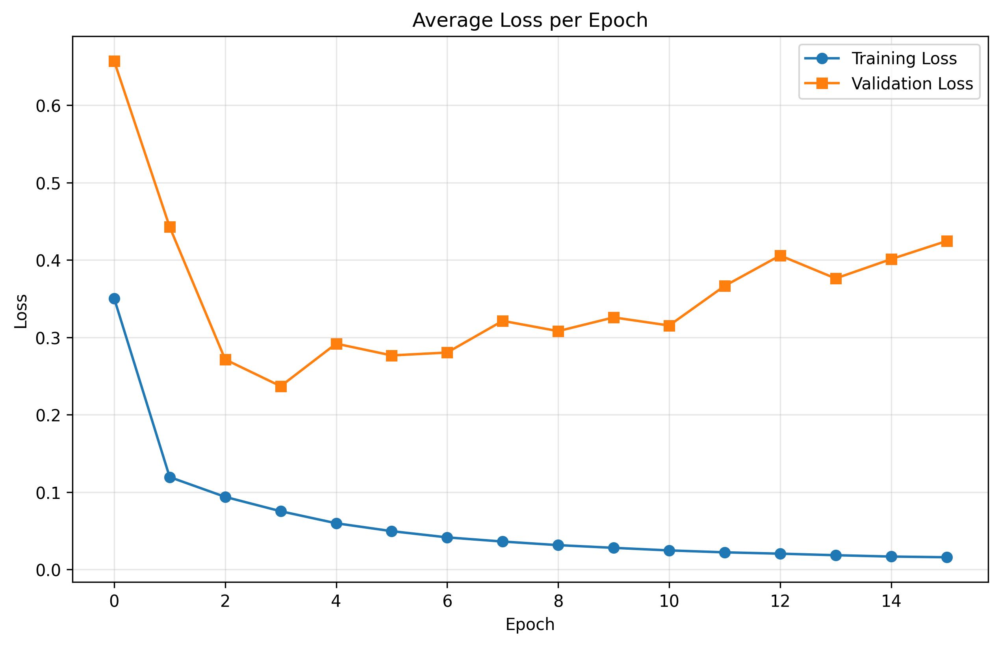
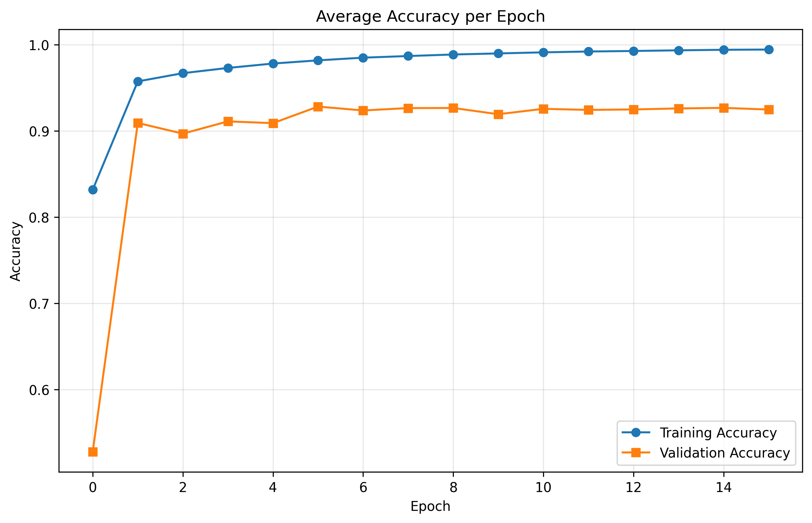

# BACHprop

**Deep Learning for Automatic Piano Hand Separation in MIDI Recordings**

[](https://www.python.org/downloads/)
[](https://www.tensorflow.org/)
[](LICENSE)

## Overview

BACHprop is a deep learning project that automatically separates piano MIDI recordings into left-hand and right-hand tracks. Using a bidirectional LSTM architecture, the model learns to assign each note to the correct hand based on musical context, enabling musicians to convert single-track MIDI files into dual-track formats suitable for notation software and sheet music generation.

### The Problem

The MIDI protocol efficiently stores pitch, velocity, and timing information but lacks hand assignment data for piano recordings. This creates significant obstacles when importing MIDI files into notation software:
- Notes are placed on a single staff or incorrectly distributed across treble and bass claves
- Manual editing is time-consuming and error-prone
- Simple pitch-threshold methods fail for complex passages with overlapping registers or hand crossings

### Our Solution

BACHprop uses deep learning to understand musical context and make intelligent hand assignments. The model achieves **92.4% accuracy** on validation data, substantially outperforming naive baseline methods (~50% accuracy) and requiring minimal manual correction for most pieces.

## Features

- **Multiple Model Architectures**: BiLSTM (primary), CNN, LSTM, MLP, and Transformer-based attention models
- **Robust Data Augmentation**: Pitch shifting, time stretching, velocity scaling, and noise injection to prevent overfitting
- **High Accuracy**: 92.4% validation accuracy with the BiLSTM model
- **Production-Ready**: Trained on 337 pieces spanning classical and contemporary repertoire
- **Easy-to-Use**: Simple command-line interface for predictions on new MIDI files
- **Visualization Tools**: Built-in visualization for analyzing model predictions

## Table of Contents

- [Installation](#installation)
- [Quick Start](#quick-start)
- [Dataset](#dataset)
- [Model Architecture](#model-architecture)
- [Training](#training)
- [Evaluation](#evaluation)
- [Results](#results)
- [Project Structure](#project-structure)
- [Challenges and Solutions](#challenges-and-solutions)
- [Future Work](#future-work)
- [Authors](#authors)
- [References](#references)

## Installation

### Prerequisites

- Python 3.8 or higher
- pip package manager

### Setup

1. Clone the repository:
```bash
git clone https://github.com/lemonadedw/BACHprop.git
cd BACHprop
```

2. Create a virtual environment (recommended):
```bash
python -m venv venv
source venv/bin/activate  # On Windows: venv\Scripts\activate
```

3. Install dependencies:
```bash
pip install -r requirements.txt
```

### Dependencies

- TensorFlow >= 2.0.0
- pretty-midi >= 0.2.0
- NumPy >= 1.20.0
- music21 >= 8.0.0
- matplotlib >= 3.5.0

## Quick Start

### Predict Hand Separation for a MIDI File

```bash
python predict.py path/to/input.mid --output path/to/output.mid
```

This will load the trained model and create a new MIDI file with separate tracks for left and right hands.

### Train the Model

```bash
python train.py
```

Training will:
- Load data from `PianoFingeringDataset_v1.2/FingeringFiles` and `Musescore/FingeringFiles`
- Apply data augmentation (7x expansion)
- Train for 16 epochs with batch size 128
- Save the best model to `best_model.keras`
- Generate training plots (`train_loss.png`, `train_accuracy.png`)

### Visualize Predictions

```bash
python visualize_prediction.py path/to/input.mid
```

This generates an interactive HTML visualization showing:
- Notes colored by hand (green = correct, red = incorrect)
- Distribution of notes across the keyboard
- Model confidence scores

## Dataset

### Sources

Our dataset combines two primary sources:

1. **PianoFingeringDataset v1.2** (309 files)
   - Publicly available dataset designed for piano fingering research
   - Classical pieces with varying difficulty levels
   - Detailed hand and finger annotations

2. **MuseScore Scrapes** (28 files)
   - Advanced and expert-level pieces
   - Pop songs and complex arrangements
   - Challenging hand interactions and crossings

### Statistics

- **Total pieces**: 337 MIDI files
- **Total notes**: ~179,550 labeled notes
- **Sequences**: 3,591 sequences of 50 notes each
- **After augmentation**: 20,104 training sequences (7x increase)
- **Train/Val split**: 80/20 at the piece level

### Data Preprocessing

Each note is represented by a 4-dimensional feature vector:
1. **Pitch**: Normalized MIDI pitch (0-127) → [0, 1]
2. **Duration**: Note duration in seconds
3. **Delta Time**: Time since previous note onset
4. **Velocity**: Normalized velocity (0-127) → [0, 1]

### Data Augmentation

To prevent overfitting and improve generalization, we apply:
- **Pitch Shifting**: Random transposition by ±24 semitones
- **Time Stretching**: Tempo variation (0.95x - 1.05x)
- **Noise Injection**: Small random perturbations (σ = 0.015)
- **Velocity Scaling**: Dynamic variation (0.85x - 1.15x)

## Model Architecture

### Bidirectional LSTM (Primary Model)

```
Input: (batch, 50, 4)
├── BiLSTM(128 units) + BatchNorm + Dropout(0.1)
├── BiLSTM(64 units) + BatchNorm + Dropout(0.1)
└── TimeDistributed(Dense(1, sigmoid))
Output: (batch, 50, 1)
```

**Key Design Choices:**
- **Bidirectional**: Captures both forward and backward temporal dependencies
- **Stacked Layers**: First layer (256 total units) for feature extraction, second layer (128 units) for higher-level patterns
- **Batch Normalization**: Stabilizes training
- **Dropout**: Prevents overfitting
- **TimeDistributed**: Applies classification to each timestep independently

### Alternative Architectures

We also implemented and evaluated:

- **CNN**: 4 convolutional layers with decreasing filters (128→128→64→32)
- **LSTM**: Unidirectional 2-layer LSTM with 128 units per layer
- **Attention**: Transformer encoder with 3 blocks, 8 attention heads
- **MLP**: 2-layer dense network with 128 units per layer

See `model.py` for implementation details.

## Training

### Hyperparameters

- **Batch Size**: 128
- **Learning Rate**: 0.001 (Adam optimizer)
- **Epochs**: 16
- **Sequence Length**: 50 notes
- **Loss Function**: Binary cross-entropy
- **Random Seed**: 190273 (for reproducibility)

### Training Procedure

```python
from train import train

# Train with default hyperparameters
train()
```

The training process:
1. Loads data from both datasets
2. Splits into 80% train, 20% validation
3. Applies augmentation to training set only
4. Trains with model checkpointing (saves best validation accuracy)
5. Generates loss and accuracy plots

### Training Curves


*Training and validation loss over 16 epochs. Both curves show consistent decrease.*


*Training (97%) and validation (92%) accuracy over 16 epochs.*

## Evaluation

### Evaluation Metrics

- **Primary Metric**: Note-level accuracy (percentage of notes correctly assigned)
- **Baseline**: Pitch-threshold heuristic (notes below middle C → left hand)

### Model Comparison

| Model | Validation Accuracy | Vivaldi's Summer |
|-------|-------------------|------------------|
| **CNN** | **92.58%** | 72.66% |
| **BiLSTM** | **92.41%** | 71.82% |
| Attention | 91.41% | 74.65% |
| LSTM | 91.16% | 78.21% |
| MLP | 85.22% | 79.85% |
| Baseline | ~50% | N/A |

### Run Evaluation

```bash
python visualize_prediction.py path/to/test.mid
```

## Results

### Quantitative Performance

- **Best Model**: CNN (92.58%) / BiLSTM (92.41%)
- **Improvement over Baseline**: +42 percentage points
- **Training Accuracy**: 97%
- **Validation Accuracy**: 92%

### Generalization

Testing on Vivaldi's *Summer* (technically demanding, rapid passages, hand crossings):
- Performance drops for all models (71-79%)
- Simpler models (MLP, LSTM) show better generalization
- Complex models (CNN, BiLSTM) may be more sensitive to distribution shifts

### Qualitative Observations

- **Strengths**: Handles overlapping registers, alternating hands, typical classical patterns
- **Weaknesses**: Struggles with extreme hand crossings and notes in upper range of left hand
- **Bias**: Some residual pitch-threshold bias despite augmentation

### Goal Achievement

✅ **Base Goal**: Outperform naive baseline (achieved: 92% vs 50%)  
✅ **Target Goal**: Practical usability with minimal manual correction  
⚠️ **Stretch Goal**: Generalize to highly complex repertoire (partially achieved)

## Project Structure

```
BACHprop/
├── model.py                    # Model architectures (BiLSTM, CNN, LSTM, Attention, MLP)
├── train.py                    # Training script
├── predict.py                  # Inference script
├── data_loader.py              # Dataset loading and preprocessing
├── data_augmentation.py        # Data augmentation functions
├── visualize_prediction.py     # Prediction visualization
├── html_visualization.py       # HTML visualization utilities
├── generate_test_midi.py       # Test MIDI generation
├── requirements.txt            # Python dependencies
├── best_model.keras            # Trained model weights
│
├── PianoFingeringDataset_v1.2/ # Primary dataset
│   └── FingeringFiles/         # 309 annotated pieces
│
├── Musescore/                  # Supplementary dataset
│   ├── FingeringFiles/         # 28 challenging pieces
│   └── raw_data/               # Original MIDI files
│
├── static/                     # Sample MIDI files
│   ├── test_input.mid
│   ├── test_output_retrained.mid
│   ├── bach.mid, mozart.mid, etc.
│   └── ...
│
└── webscraper/                 # Data collection scripts
    └── musescore/              # MuseScore scraper
```

## Challenges and Solutions

### 1. Degenerate Middle-C Baseline

**Problem**: Model converged to pitch-threshold strategy (50% accuracy)

**Solution**: Pitch-shifting augmentation (±24 semitones) forces learning of relative patterns rather than absolute pitch thresholds

### 2. Data Scarcity

**Problem**: Limited hand-annotated MIDI datasets

**Solution**: 
- Built custom web scrapers for MuseScore
- Applied comprehensive data augmentation (7x expansion)
- Collected diverse repertoire spanning classical to contemporary

### 3. Context Length vs. Computational Efficiency

**Problem**: Piano pieces vary in length; full-sequence processing is slow

**Solution**: Fixed-length sequences (50 notes) capture local patterns while remaining computationally efficient

## Future Work

- **Improved Generalization**: Test on broader repertoire, especially challenging contemporary pieces
- **Hand Crossing Detection**: Specialized handling for passages where hands cross
- **Confidence Scoring**: Provide uncertainty estimates for predictions
- **Real-Time Processing**: Optimize for live MIDI input
- **Fingering Prediction**: Extend to predict individual finger assignments
- **Multi-Track Support**: Handle piano + accompaniment arrangements

## Authors

**Authors listed in alphabetical order:**

- **Jeffery Gao** - Brown University - tian_gao1@brown.edu
- **Jiawei Ren** - Brown University - jiawei_ren1@brown.edu
- **Henry Wang** - Brown University - henryw@brown.edu
- **Youwei Zhen** - Brown University - youwei_zhen@brown.edu

*CSCI 1470: Deep Learning - Brown University*

## References

1. R. Parncutt et al., "An ergonomic model of keyboard fingering for melodic fragments," *Music Perception*, vol. 14, no. 4, pp. 341–382, 1997.

2. P. B. Kirlin and P. E. Utgoff, "VoiSe: Learning to segregate voices in explicit and implicit polyphony," *Proc. 6th International Conference on Music Information Retrieval*, pp. 552–557, 2005.

3. R. Volk and T. Weyde, "Deep neural networks with voice entry estimation heuristics for voice separation in symbolic music representations," *Proc. ISMIR*, 2018.

4. A. Hadjakos et al., "Detecting Hands from Piano MIDI Data," *Mensch und Computer*, 2019.

5. Y. Nakamura, Y. Saito, and K. Yoshii, "Statistical Learning and Estimation of Piano Fingering," *arXiv preprint arXiv:1904.10237*, 2019.

## License

This project is open source and available for research and educational purposes.

## Acknowledgments

We thank the CSCI 1470 teaching staff at Brown University for their guidance and support throughout this project. Special thanks to the creators of PianoFingeringDataset v1.2 and the MuseScore community for making their annotated scores publicly available.

---

*For questions or collaboration inquiries, please open an issue on GitHub or contact the authors.*
